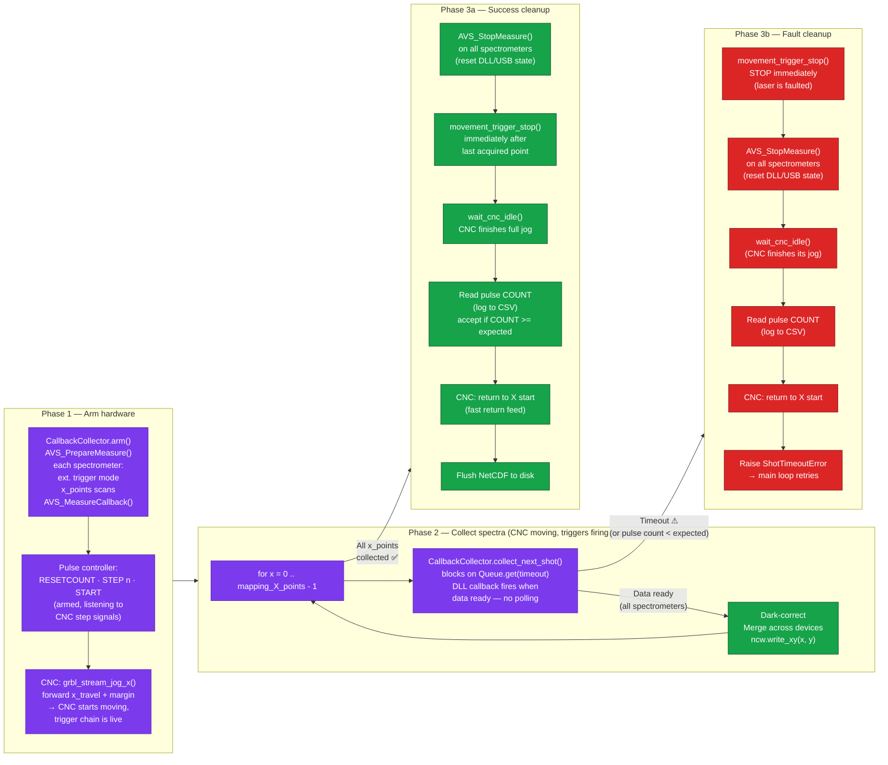
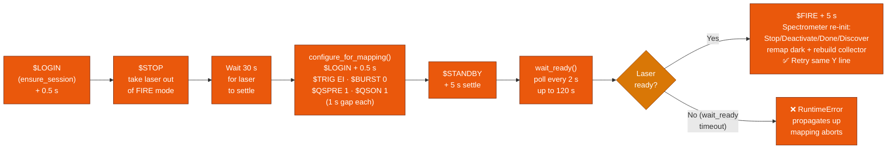

# Mapping Run Flow Chart

## Overview

This diagram traces the complete mapping acquisition flow from the GUI button click
through hardware control, data acquisition, and NetCDF file writing.

### Color legend

| Color | Meaning |
|---|---|
| 🔵 Blue | GUI actions (PyQt main thread) |
| 🟣 Purple | Background thread (MappingThread — all mapping runs here) |
| 🟢 Green | Successful operations / data writes |
| 🔶 Amber | Decision points |
| 🔴 Red | Errors / fault path |
| 🟠 Orange | Laser fault recovery sequence |
| ⚫ Grey | Final cleanup (always runs) |

## Flow Chart

```mermaid
flowchart TB
    classDef gui fill:#2563eb,stroke:#1e40af,color:#fff
    classDef thread fill:#7c3aed,stroke:#5b21b6,color:#fff
    classDef success fill:#16a34a,stroke:#14532d,color:#fff
    classDef decision fill:#d97706,stroke:#92400e,color:#fff
    classDef error fill:#dc2626,stroke:#7f1d1d,color:#fff
    classDef recovery fill:#ea580c,stroke:#7c2d12,color:#fff
    classDef cleanup fill:#64748b,stroke:#334155,color:#fff

    subgraph MAIN_THREAD ["MAIN THREAD  —  PyQt GUI  (Bruniquel_LIBS_improved.py)"]
        direction LR
        A["🖱 User clicks\nStart Mapping"]:::gui
        A --> B["_build_mapping_params()\nread BasicParamsTab\n+ AdvancedParamsTab"]:::gui
        B --> VAL{"All devices\nconnected?\nCNC · Pulse\nLaser · Spectro"}:::decision
        VAL -->|No| ERR1["❌ Abort\nshow error"]:::error
        VAL -->|Yes| PRE["_ensure_mapping_laser_ready()\nPause camera & light"]:::gui
        PRE --> SPAWN["Create MappingThread\nwith pre-established\nserial/network handles"]:::gui
        SPAWN --> START["thread.start()"]:::gui
    end

    START ==>|"spawns\nbackground\nthread"| RUN

    subgraph SETUP ["BACKGROUND THREAD ①  —  One-time setup  (MappingEngine.run)"]
        direction LR
        RUN["MappingEngine.run()"]:::thread
        RUN --> LOGIN["Laser: ensure_session()\n$LOGIN + 0.5 s settle"]:::thread
        LOGIN --> LCFG["Laser: configure_for_mapping()\n$TRIG EI · $BURST 0\n$QSPRE 1 · $QSON 1\n(1 s gap between each)"]:::thread
        LCFG --> NC["Create NetCDF file\n+ build device metadata\n+ concatenate wavelengths"]:::thread
        NC --> DARK["Capture dark spectrum\n(software trigger, 1 scan\nper spectrometer, polling)"]:::thread
        DARK --> COLL["Create CallbackCollector\n(reused across all lines)"]:::thread
    end

    COLL ==> YLOOP

    subgraph YLINE_LOOP ["BACKGROUND THREAD ②  —  Y-line scan loop  (for y = 0 .. Y-1, with fault recovery)"]
        direction LR
        YLOOP["▶ Next Y line"]:::thread
        YLOOP --> STOPCHK{"stop_event\nset?"}:::decision
        STOPCHK -->|"Yes (user\npressed Stop)"| DONE["→ go to\ncleanup"]:::cleanup

        STOPCHK -->|No| RESYNCCHK{"y % resync_every_n_lines == 0?\n(default: every 50 lines,\nexcept y=0)"}:::decision
        RESYNCCHK -->|Yes| SRESYNC["Spectrometer full re-init\n(Stop/Deactivate/Done/Discover)\nRemap dark (no new dark)\nRebuild callback collector"]:::thread
        RESYNCCHK -->|No| RETRY["Attempt 1 ..\nmax_line_retries\n(default 3)"]:::thread
        SRESYNC --> RETRY
        RETRY --> FIRSTCHK{"First line\n(y=0)?"}:::decision
        FIRSTCHK -->|Yes| LFIRE["standby_and_fire()\n$LOGIN · $STANDBY\nwait_ready (90 s)\n$FIRE + 5 s wait"]:::thread
        FIRSTCHK -->|No| NOLASER["No laser commands\n(stays in $FIRE)"]:::thread
        LFIRE --> XSCAN["_scan_single_line(y)\nsee detail below ⬇"]:::thread
        NOLASER --> XSCAN

        XSCAN -->|"✅ Line OK"| PROG["Update\nprogress %"]:::success
        XSCAN -->|"⚠ ShotTimeoutError\n(timeout / pulse count check\nfailure)"| RCHK{"Retries\nexhausted?"}:::decision

        RCHK -->|Yes| FATAL["❌ RuntimeError\npersistent laser fault\nabort mapping"]:::error
        FATAL --> DONE
        RCHK -->|No| REC["_recover_laser()\n+ spectrometer re-init\nsee detail below ⬇"]:::recovery
        REC --> RETRY

        PROG --> YLAST{"Last Y\nline?"}:::decision
        YLAST -->|No| JOGY["CNC: jog_y\n+step_size mm\nwait idle"]:::thread
        YLAST -->|Yes| PNGCHK
        JOGY --> PNGCHK{"Every N\nlines?"}:::decision
        PNGCHK -->|Yes| PNG["Save progress PNG\n(incremental band sum)\n+ optional FTP"]:::success
        PNGCHK -->|No| YLOOP
        PNG --> YLOOP
    end

    DONE ==> CLEANUP_START

    subgraph CLEANUP_BLOCK ["BACKGROUND THREAD ③  —  Cleanup  (always runs in finally block)"]
        direction LR
        CLEANUP_START["Laser: $LOGIN\nthen $STOP"]:::cleanup
        CLEANUP_START --> NCCLOSE["Close NetCDF file"]:::cleanup
        NCCLOSE --> SIGNAL["Log completion\nSignal 100 % to GUI\nRestore camera & light"]:::cleanup
    end
```



## ⬇ Detail: `_scan_single_line(y)` — one X-line acquisition



## ⬇ Detail: recovery between retries (`_recover_laser` + spectrometer re-init)



## Laser telnet command timeline

All commands enforced with **1 s minimum gap** (`CMD_GAP_S`) and **0.5 s** settle after `$LOGIN`.

### Normal mapping (no faults)

```
INIT:     $LOGIN → $TRIG EI → $BURST 0 → $QSPRE 1 → $QSON 1 → $STATUS? ×2
LINE 0:   $LOGIN → $STANDBY → [wait_ready: $STATUS? ×2 per poll] → $FIRE → 5s
LINE 1:   (nothing)
LINE 2:   (nothing)
...
LINE N:   (nothing)
END:      $LOGIN → $STOP
```

### With a fault recovery at line K

```
...
LINE K:   (timeout / pulse parity failure detected)
RECOVER:  $LOGIN → $STOP → 30s → $LOGIN → $TRIG EI → $BURST 0 → $QSPRE 1
          → $QSON 1 → $STANDBY → 5s → [wait_ready: $STATUS? ×2, poll 2s, max 120s]
          → $FIRE → 5s → spectrometer re-init
LINE K:   (retry — no laser commands)
...
```

## Hardware trigger chain (during CNC movement)

```
CNC stepper motor  ──step pulses──→  Pulse controller  ──(every N steps)──→  Trigger pulse out
                                                                                   │
                                                              ┌────────────────────┤
                                                              ▼                    ▼
                                                         Laser fires         Spectrometers
                                                         (ext. trigger)      start integration
                                                              │                    │
                                                              ▼                    ▼
                                                         Plasma emission  →  Spectrum captured
```

The software does **not** control shot timing. The hardware trigger chain runs autonomously
at the CNC's movement speed. The software arms everything, starts the motion, and collects
results as fast as they arrive.

## Timing diagram — single scan line

### Computed example values

| Parameter | Value | Formula / Source |
|---|---|---|
| step_size | 0.1 mm | user setting |
| laser_frequency | 20 Hz | user setting |
| mapping_X_size | 20 mm | user setting |
| CNC acceleration | 500 mm/s² | GRBL $120 |
| steps_per_mm | 800 | GRBL $100 |
| return_feed | 100 mm/min | MappingParams default |
| | | |
| mapping_X_points | **200** | 20 / 0.1 |
| scan speed | **2 mm/s** (120 mm/min) | 0.1 × 20 |
| step_trigger | **80 steps** | 800 × 0.1 |
| shot interval | **50 ms** | 1 / 20 |
| x_travel | **21 mm** | 20 + (0.1 × 10) |
| jog distance | **22 mm** | x_travel + 1 (code margin) |
| CNC accel time | **4 ms** | 2 / 500 |
| CNC accel distance | **0.004 mm** | 2² / (2 × 500) |
| time to first trigger | **~52 ms** after CNC start | 4 ms accel + 48 ms at 2 mm/s |
| forward scan time | **11.0 s** | 22 / 2 |
| return time | **13.2 s** | 22 / (100/60) |
| **total line time** | **~24.4 s** | arm + scan + return |
| scan efficiency | **~41 %** | 10.1 / 24.4 (return dominates) |

### Full line overview (~24 s)

```mermaid
gantt
    title Single scan line — 20 Hz · 0.1 mm · 200 pts · 22 mm jog
    dateFormat x
    axisFormat %M:%S
    tickInterval 2000

    section Software
    Arm spectro (callback) + pulse (120 ms)  :done, 0, 120
    Send JOG command                         :done, 120, 170
    Collect (callback queue) ×200 pts        :active, 170, 10070
    AVS_StopMeasure (all devices)            :crit, 10070, 10100
    STOP triggers (immediate)                :crit, 10070, 10120
    Wait CNC idle                            :10120, 11120
    Read COUNT (>= expected)                 :done, 11120, 11170
    Send return JOG                          :done, 11170, 11220
    Wait CNC return (13.2 s @ 100 mm/min)   :11220, 24420
    Flush NetCDF                             :crit, 24420, 24470

    section CNC motor
    Idle                                     :done, 0, 120
    Forward 22 mm @ 2 mm/s (accel 4 ms)     :active, 120, 11120
    Idle (wait for STOP cmd)                 :done, 11120, 11220
    Return 22 mm @ 100 mm/min               :11220, 24420
    Idle                                     :done, 24420, 24470

    section Pulse controller
    Idle                                     :done, 0, 110
    Armed + generating triggers              :active, 110, 10120
    Stopped                                  :done, 10120, 24470

    section Laser (in FIRE mode — entire mapping)
    Waiting for trigger                      :done, 0, 170
    Firing ×200 shots (mapping area)         :crit, 170, 10070
    Waiting for trigger (between lines)      :done, 10070, 24470

    section Spectrometers (callback mode)
    Armed — waiting for ext. trigger         :done, 30, 170
    Integrating ×200 scans (50 ms each)      :active, 170, 10070
    Stopped (AVS_StopMeasure)                :done, 10070, 24470

    section NetCDF file
    Dark spectrum in memory                  :done, 0, 170
    Progressive writes x=0..199              :active, 170, 10070
    Waiting for flush                        :done, 10070, 24420
    Flush to disk                            :crit, 24420, 24470
```



### Zoom: arm phase (first 300 ms)

```mermaid
gantt
    title Arm phase detail — first 300 ms of a scan line
    dateFormat x
    axisFormat %L ms
    tickInterval 50

    section Software calls
    AVS_PrepareMeasure ×3 devices            :active, 0, 15
    AVS_MeasureCallback(×200) ×3 devices     :active, 15, 30
    sleep(50 ms) before pulse cmd            :done, 30, 80
    Write STEP 80 + read ack                 :active, 80, 90
    sleep(20 ms)                             :done, 90, 110
    Write START                              :crit, 110, 115
    Write $J=G91 X22 F120                    :crit, 115, 120
    First callback fires (x=0)               :active, 170, 230

    section Spectrometers
    Configuring (PrepareMeasure)             :active, 0, 15
    Armed — ext trigger, 200 scans, callback :done, 15, 170
    Shot 1 integration                       :crit, 170, 175
    Shot 2 integration                       :crit, 220, 225
    Shot 3 integration                       :crit, 270, 275

    section Pulse controller
    Receives STEP 80                         :active, 80, 90
    Receives START — armed                   :crit, 110, 115
    Counting CNC steps ...                   :done, 115, 170
    Trigger 1 (80 steps reached)             :crit, 170, 172
    Trigger 2                                :crit, 220, 222
    Trigger 3                                :crit, 270, 272

    section CNC motor
    Idle                                     :done, 0, 120
    Accelerating 0→2 mm/s (4 ms)             :crit, 120, 124
    Constant speed 2 mm/s                    :active, 124, 300

    section Laser
    In FIRE mode — waiting for trigger       :done, 0, 170
    Shot 1 (ext. trigger received)           :crit, 170, 172
    Shot 2                                   :crit, 220, 222
    Shot 3                                   :crit, 270, 272
```



### Key timing notes

- **Laser stays in $FIRE for the entire mapping run**. No commands are sent between lines.
  Only the first line performs `standby_and_fire()`. This minimises CAN bus traffic and
  avoids overrun warnings.
- **All laser telnet commands** are paced with a **1 s minimum gap** (`CMD_GAP_S`) enforced
  in `VironLaser._send()`. `ensure_session()` adds an extra **0.5 s** after `$LOGIN`.
- **Spectrometer collection uses callbacks** (`AVS_MeasureCallback` + `Queue.get`) instead
  of busy-polling with `AVS_PollScan`. The DLL invokes a callback from its own thread;
  the mapping thread blocks efficiently on the queue.
- **`AVS_StopMeasure` is called after every line** (success and failure) to reset DLL/USB
  state. Without this, internal buffers accumulate and spectrometers desynchronize after
  ~190 lines.
- **Pulse controller counter is checked every line** using `RESETCOUNT` (line start) and
  `COUNT` (after forward jog). A CSV log (`pulse_count_log.csv`) records expected vs measured.
- **Pulse parity rule:** line is valid if `COUNT >= expected_shots`; line fails only when
  `COUNT < expected_shots` (extra overscan pulses are accepted).
- **Spectrometers auto-stop** after receiving exactly `x_points` triggers. Extra triggers
  from the margin are silently ignored once the count is reached.
- **`movement_trigger_stop()` is sent immediately after the last stored point** on success,
  preventing additional off-map shots during deceleration/remaining jog distance.
- **On fault**, triggers are stopped immediately — there is no point sending more triggers
  to a faulted laser.
- **Periodic spectrometer re-initialization** runs every `resync_every_n_lines` (default 50)
  to flush long-run DLL/USB state; existing dark is remapped (no new dark capture).
- **Progress PNG generation** sums bands incrementally (one slab at a time) to avoid loading
  the entire multi-GB cube into RAM. Matplotlib figures are wrapped in `try/finally` to
  prevent memory leaks.

## Step-by-step summary

1. **GUI validates** (main thread) that all four devices are connected (CNC, pulse controller, laser, spectrometers) before anything starts.
2. **Pre-established connections** are passed to the background thread — the mapping code never opens its own connections.
3. **MappingThread** (background thread) builds a `MappingParams` dataclass and hands it to `MappingEngine`.
4. **One-time setup** (background thread): logs in to the laser, configures for mapping mode, captures a dark spectrum, creates the NetCDF file, initialises the `CallbackCollector`.
5. **First line**: full `standby_and_fire()` — `$LOGIN`, `$STANDBY`, `wait_ready` (up to 90 s), `$FIRE`, 5 s settle — then scan.
6. **Lines 1..N**: no laser commands at all. The laser stays in `$FIRE` and the hardware trigger chain runs autonomously.
7. **Periodic maintenance**: every `resync_every_n_lines` (default 50), spectrometers are fully re-initialized and callback state is rebuilt; dark is reused (remapped), not recaptured.
8. **_scan_single_line()** — three phases:
   - **Arm**: configure spectrometers for callback-based external-trigger acquisition (`x_points` scans), pulse `RESETCOUNT`, arm pulse controller (`STEP n` + `START`), start CNC X jog (with extra margin beyond mapping area).
   - **Collect**: for each X point, `CallbackCollector.collect_next_shot()` blocks on a `Queue` (DLL callback notification, no polling). Data is dark-corrected, merged across devices, and written to NetCDF.
   - **Cleanup (always)**: `AVS_StopMeasure()` on all spectrometers (resets DLL/USB state).
   - **Cleanup (success)**: `movement_trigger_stop()` immediately after the last stored point, `wait_cnc_idle()`, read pulse `COUNT` (must be `>= x_points`), return CNC to line start, flush NetCDF.
   - **Cleanup (fault)**: `movement_trigger_stop()` immediately, `wait_cnc_idle()`, read pulse `COUNT` for diagnostics, return CNC, raise `ShotTimeoutError`.
9. **Fault detection**: timeout in `collect_next_shot()` **or** pulse parity failure (`COUNT < x_points`) raises `ShotTimeoutError`.
10. **Automatic recovery**: the main loop catches the failure, runs `_recover_laser()`, then full spectrometer re-init + callback rebuild, then retries the same line. After `max_line_retries` consecutive failures on the same line, mapping aborts with a clear error.
11. After each successful line, it moves Y, and every N lines generates a progress image.
12. **Cleanup** (always runs): `$LOGIN` → `$STOP`, close the NetCDF file.

## Configurable fault-recovery parameters (MappingParams)

| Parameter | Default | Description |
|---|---|---|
| `shot_timeout_s` | 30.0 | Seconds to wait for a single spectrometer callback before declaring a timeout |
| `max_line_retries` | 3 | Maximum retry attempts per line before aborting the mapping |
| `line_start_wait_s` | 5.0 | Seconds to wait after `$FIRE` before starting the first scan line |
| `resync_every_n_lines` | 50 | Perform full spectrometer DLL re-init every N lines (`0` disables periodic resync) |

---

## Mapping procedure review (memory, resources, context)

Periodic review of the mapping pipeline for memory leaks, resource lifecycle, and integration with preview, camera, and CNC.

### Memory and resources

| Area | Status | Notes |
|------|--------|--------|
| **NetCDF** | OK | Single `Dataset` opened in `NetCDFCubeWriter`, closed in `run()`'s `finally` block. No leak. |
| **Progress PNG** | OK | `save_progress_png` uses `with Dataset(..., "r")`; bands summed incrementally (one slab per band) so memory stays flat; `plt.figure()` wrapped in `try/finally` with `plt.close(fig)`. No cube-sized allocation or figure leak. |
| **CallbackCollector** | OK | One collector per run; queues drained at start of each line in `arm()`. `AVS_StopMeasure` after every line prevents DLL buffer buildup. Callback trampoline kept on `self._cb` for GC safety. |
| **Per-line data** | OK | `merged_vecs[x]` is `del`-ed after each `write_xy`; only one X index in memory at a time. |
| **Dark capture** | OK | `capture_dark_once` uses polling then returns; no callback left registered. Next `collector.arm()` re-arms for callback mode. |
| **Laser / CNC / pulse** | OK | Handles are pre-established and passed in; mapping engine does not open or close them. Cleanup only sends `$STOP` and closes NetCDF. |

### GUI and context

| Area | Status | Notes |
|------|--------|--------|
| **Camera** | OK | `_pause_camera_for_mapping()` stops the camera (and join with timeout); `_finalize_mapping_run()` always calls `_resume_camera_after_mapping()` when the mapping thread ends (success or exception). No leak of camera or thread. |
| **Progress plot** | OK | `ProgressPlotWidget.update_plot()` uses `fig.clear()` then new `imshow(img)`; previous image is dropped. `plt.imread` each refresh is one image in memory. Timer-driven refresh is bounded. |
| **Mapping thread** | OK | `MappingThread` holds references to params and spectrometer data only for the duration of `run()`. After `_finalize_mapping_run()` sets `mapping_thread = None`, the thread object and its references can be GC'd. |
| **Stop / completion** | OK | `_check_mapping_thread()` runs on a timer; when the thread is no longer alive, `_finalize_mapping_run()` runs (disconnect laser, re-enable UI, resume camera and light). Same path for normal completion and error. |

### Bug fixes applied during review

- **Identities vs selected handles**: When `selected_handles` is used, identities are now filtered by building `identity_by_handle` from the original `(handles_sorted, identities)` order, then rebuilding `identities` as `[identity_by_handle[h] for h in handles_sorted]` so device metadata in the NetCDF matches the chosen devices.
- **Default `line_start_wait_s`**: Default in `MappingThread` when building `MappingParams` from the GUI was set to `5.0` (was `10`) to match `MappingParams` and the UI default.

### Recommendations

- **progress_every_lines = 0**: If set to 0, no progress PNG is written; the condition `if p.progress_every_lines and ((y + 1) % ...)` correctly skips. No change needed.
- **Long runs**: For very long maps (many hours), the only long-lived allocations are the NetCDF file (on disk and in the open Dataset) and the CallbackCollector queues (bounded by one notification per shot per device). No unbounded in-memory growth expected.
- **App exit during mapping**: The mapping thread is non-daemon; closing the app may block until the thread exits or the user stops mapping. Consider handling `closeEvent` to set `stop_event` and optionally wait for the thread with a short timeout before quitting.
